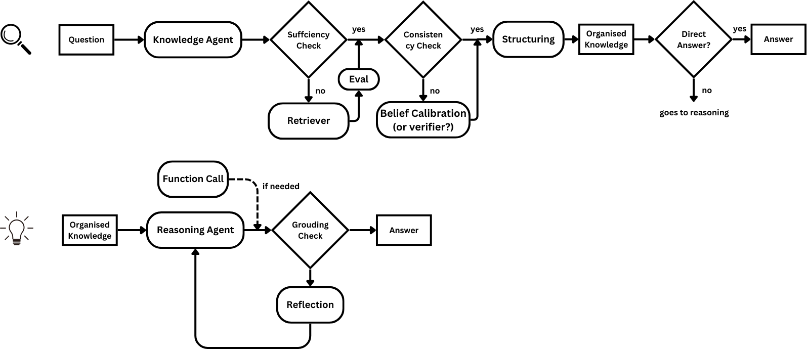

# The Librarian Paradigm: Structured Knowledge and Grounded Reasoning

## Introduction

Large language models (LLMs) often hallucinate, and it’s difficult to pinpoint the root cause — is it faulty knowledge or flawed reasoning? Given that knowledge is ever-changing while reasoning patterns remain relatively stable, why not **separate the two stages before generating an answer**? Much like a *librarian*, we could introduce a knowledge agent responsible for locating and organising relevant information. Reasoning would then operate solely on this curated knowledge, ensuring greater transparency and control over the final output.

## Road Map

> Important code reference by OpenAI: https://github.com/openai/simple-evals

